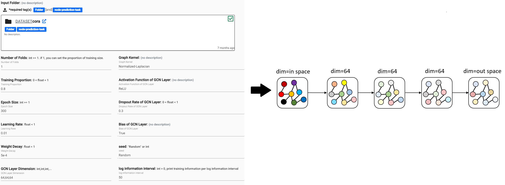
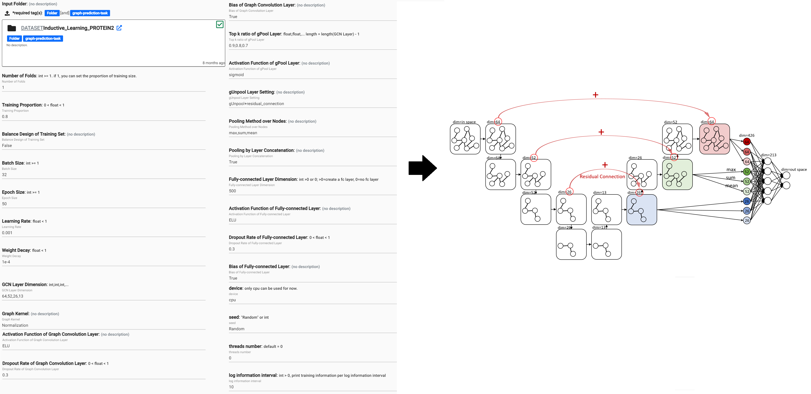

# Graph Convolution Network (GCN)

Graph data are gaining more importance in recent year. Comparing with traditional data, graph data provide an addtional information of edges which stand for the connection of subjects. I established a series of pacakges to build flexible costumized GCN models for user, so that user can create GCN models easily. 

These packages can deal with 2 graph-relating tasks including node prediction (called "inductive learning") and graph prediction (called "transductive learning"). Packages are based on 3 different methods of feature propagation between nodes including [classic GCN](https://arxiv.org/abs/1606.09375), [Graph-U-Nets](https://arxiv.org/abs/1905.05178) and [Graph Attention Networks (GATs)](https://arxiv.org/abs/1710.10903).

## User can design their own model

- Node prediction: classic GCN model as example

- Graph prediction: Graph-U-Nets model as example

## Cora Dataset as Demo for node prediction

| Model | 10-fold Accuracy | std. |
| ---- | ---- | ---- |
| GCN | 88.59% | 2.39% |
| G-U-Net  | 87.70% | 3.03% |
| GATs | 89.09% | 2.95% |

## Proteins Dataset as Demo for graph prediction

| Model | tips | 10-fold Accuracy | std. |
| ---- | ---- | ---- | ---- |
| GCN | None | 67.35% | 3.89% |
| GCN | Residual Connection | 69.15% | 4.59% |
| GCN | Residual Connection + max, sum, mean pooling | 73.33% | 4.07% |
| G-U-Nets | Residual Connection + max, sum, mean pooling | 73.25% | 3.99% |
| G-U-Nets | Residual Connection + max, sum, mean pooling + UnPool| 74.11% | 2.26% |

## References

1. [Convolutional Neural Networks on Graphs with Fast Localized Spectral Filtering](https://arxiv.org/abs/1606.09375)

2. [Graph-U-Nets](https://arxiv.org/abs/1905.05178)

3. [Graph Attention Networks](https://arxiv.org/abs/1710.10903)
