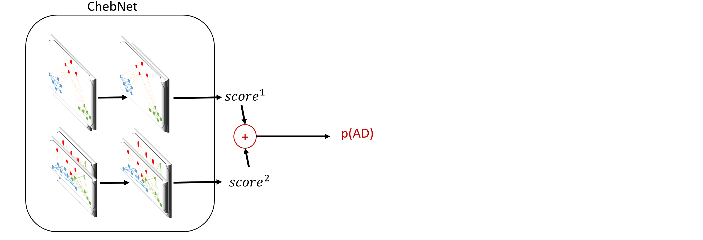

# SAC-GCN for Alzheimer Disease (AD) prediction of CG-MMRC Data

In traditional machine learning, we used to concern clinical score to differentiate between AD (Alzheimer Disease) and MCI (Mild Cognitive Impairment). Because both groups usually express similar clinical symptoms, it is hard to find a acceptable rule to divide between AD and MCI. 

Furthemore, we want to use the information of brain functions as additional features to enhance the ability of our prediction model. Positron Emission Tomography (PET) or Magnetic Resonance Imaging (MRI) are usually taken as patient's brain function. Following the methods of [SAC-GCN](https://www.sciencedirect.com/science/article/pii/S136184152030311X), we selected 2 PET information to create connective graph concerning similarities of brain function. After the similarity graph were establish, GCN (Graph Convolution Network) were applied to catogorize AD and MCI.

## Model

1. use two brain structure to build graph data

2. GCN to feature propagation & prediction

## Results of our data

| Model | 100 times of accuracy | std. |
| ---- | ---- | ---- |
| SVM(linear) | 52.86% | 7.80% |
| SVM(poly) | 51.63% | 7.79% |
| SVM(sigmoid) | 54.84% | 6.89% |
| SVM(rbf) | 44.42% | 6.54% |
| random forest | 72.98% | 4.54% |
| S-GCN | 76.23% | 6.08% |
| SA-GCN  | 74.23% | 9.03% |
| SAC-GCN | 73.33% | 8.10% |

After we applied the information of brain functions, we found the accuracy are greater than those of traditional machine learning. However, the accuracy were not improvement in our dataset when "A" or "AC" technics were applied.

## References

[Graph convolution network with similarity awareness and adaptive calibration for disease-induced deterioration prediction](https://www.sciencedirect.com/science/article/pii/S136184152030311X)