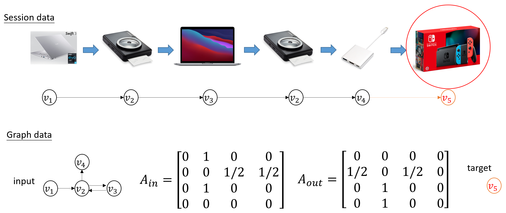
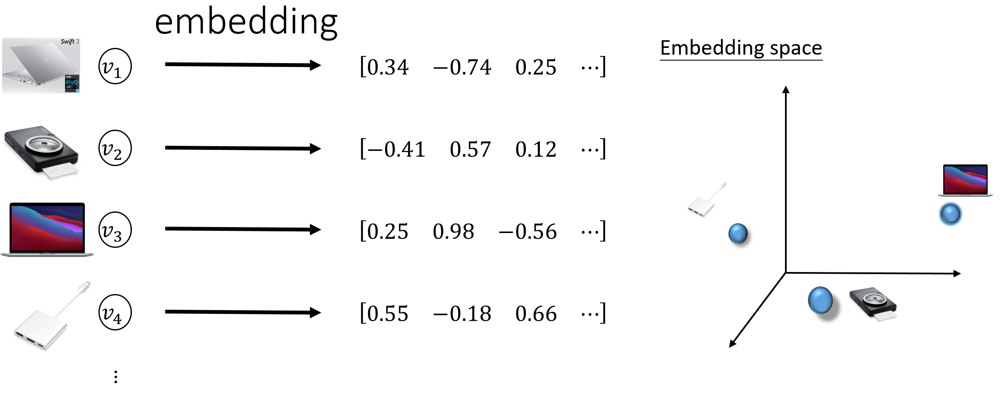
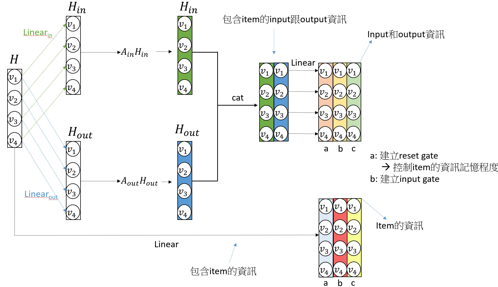
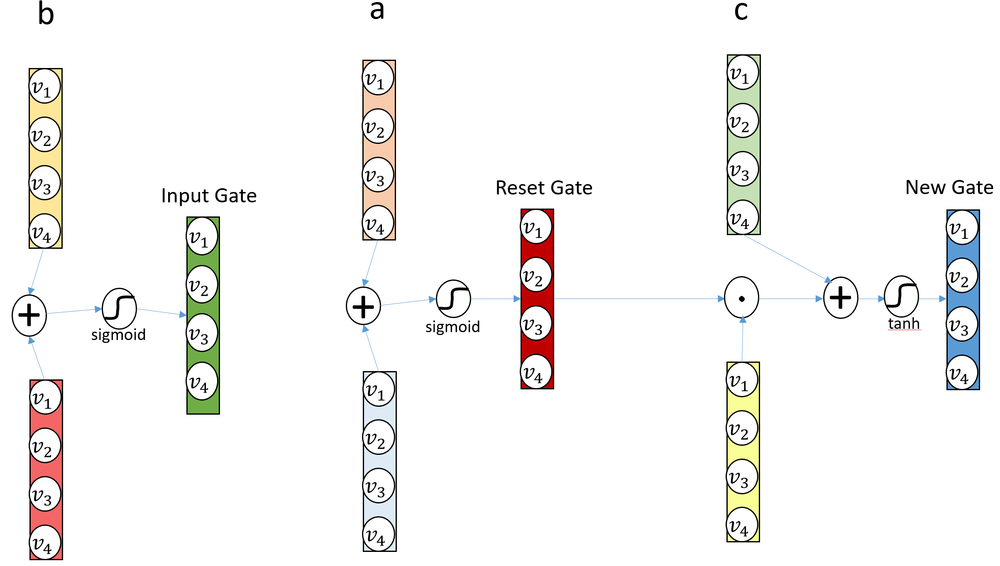
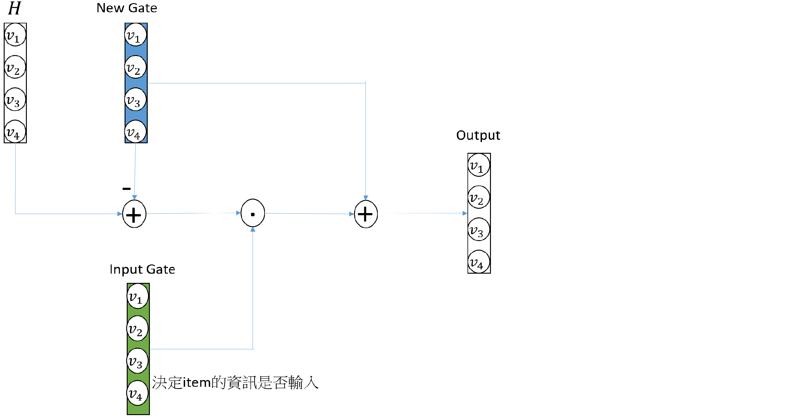

# Session-based Recommendation with GNN

In applications of Graph Neural Network (GNN), recommender system is an applicable area where GNN outperforms other non-GNN model in recent years such as [Session-based Recommendation with Graph Neural Networks (SR-GNN)](https://arxiv.org/abs/1811.00855), [Graph Convolutional Neural Networks for Web-Scale Recommender Systems](https://arxiv.org/abs/1806.01973) and [Graph Neural Networks in Recommender Systems: A Survey](https://arxiv.org/abs/2011.02260).

## Session-based Recommendation GNN (SR-GNN)

1. data preprocess

If there is no web-user's preference data or full browser histories, it is important that "session" in server with partly browsing records of merchandise can be used to predict a next product which web-user should be interested in. First, convert session data to graph data and get the adjacent matrix including A_in and A_out. Second, transform merchandise items to orthogonal embedding space.

- convert session to graph data

- convert items to embedding space

2. modeling of SR-GNN

Rules of features propogation imitate LSTM algorithm which includes memory cell, input gate and reset gate. The algorithm of SR-GNN were shown as following graphs.

- convolution with adjacency matrix(A_in & A_out) to prepare materials for creating gates

- create input gate, reset gate and new gate

- get output (finalize propagation of informations)

## references

- [Session-based Recommendation with Graph Neural Networks (SR-GNN)](https://arxiv.org/abs/1811.00855)

- https://github.com/CRIPAC-DIG/SR-GNN